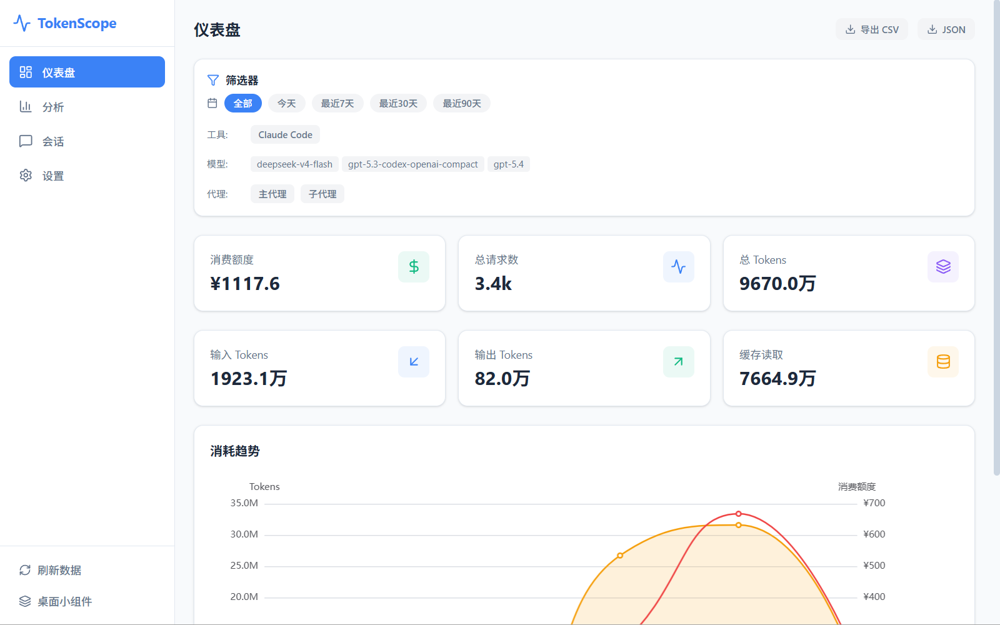
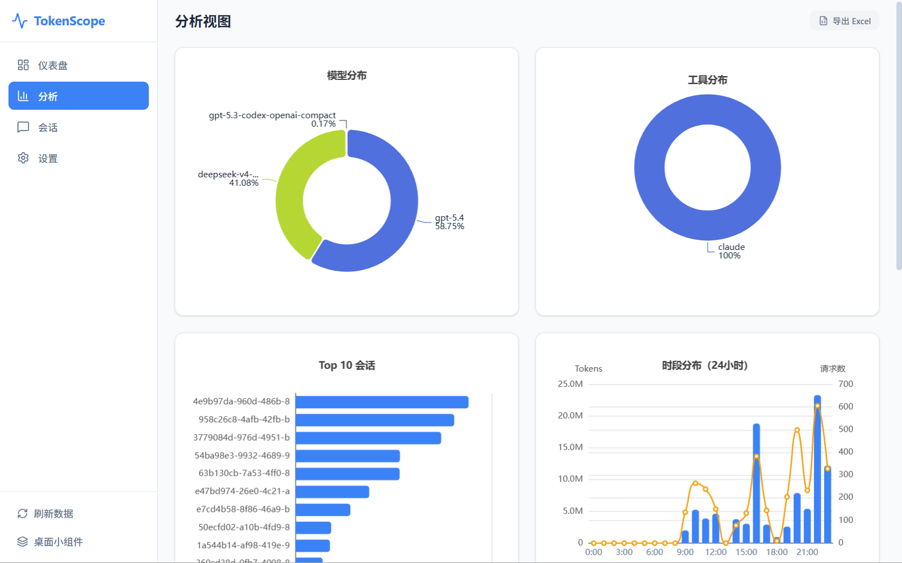
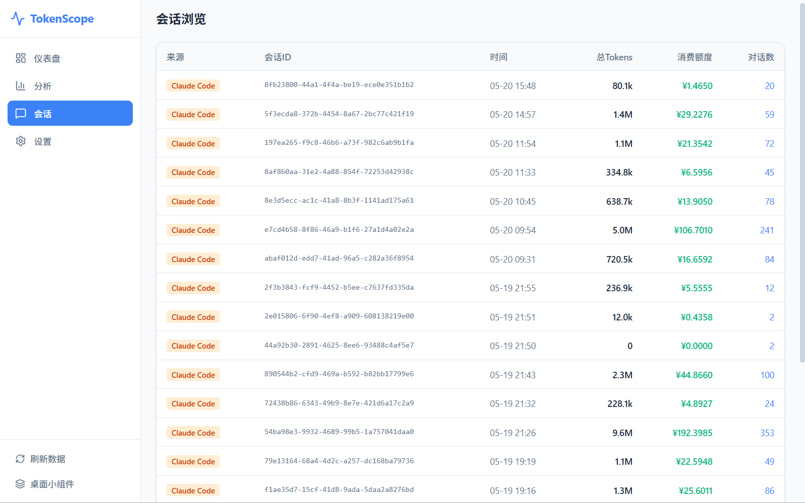
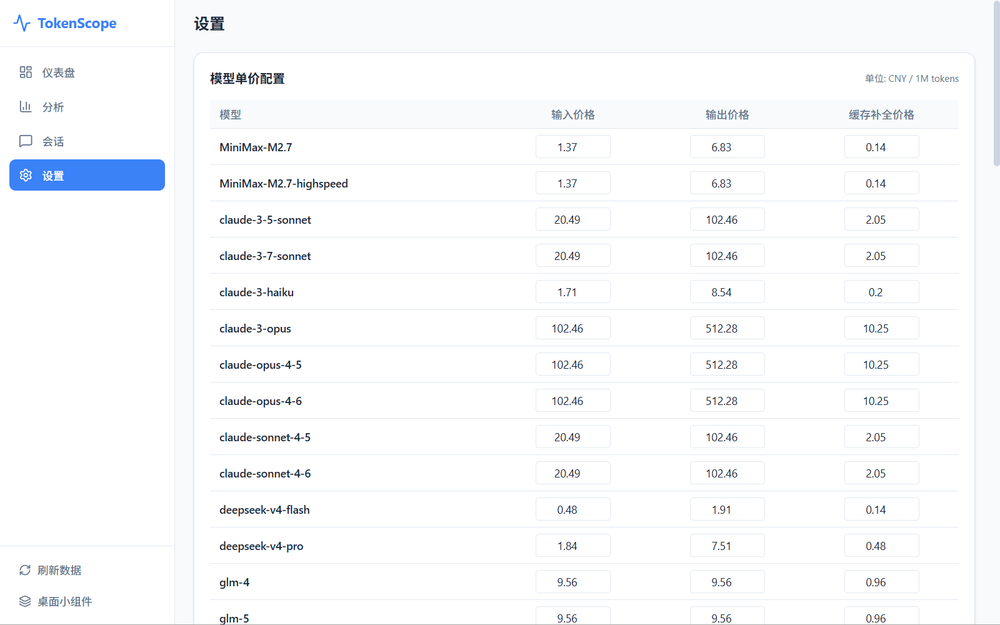
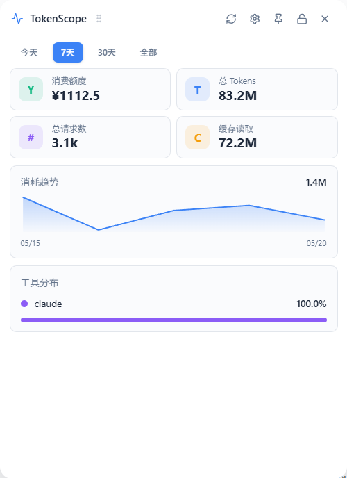

# TokenScope

> Local-first desktop analytics for AI coding assistant token usage, cache reads, and estimated cost.  
> 面向 AI 编程助手的本地优先 Token 用量、缓存读取与消费额度分析桌面工具。

<p align="center">
  
  
  
  
</p>

TokenScope turns local AI coding session logs into a clear, searchable, and exportable desktop dashboard.  
TokenScope 用桌面化的方式，把本机 AI 编程会话日志整理成清晰、可检索、可导出的使用分析面板。

It helps answer questions like:  
它可以帮助你快速回答这些问题：

- How many tokens did I use today? / 我今天用了多少 Token？
- Which model or tool consumed the most? / 哪个模型或工具消耗最多？
- Which sessions were the most expensive? / 哪些会话最贵？
- When was usage concentrated? / 使用主要集中在哪些时段？
- How much cache read usage contributed to the total? / 缓存读取在总量里占了多少？

No cloud account is required. No backend service is required. Your data stays local by default.  
不需要云端账号，不依赖后端服务，数据默认保留在本地。

---

## Why TokenScope / 为什么使用 TokenScope

TokenScope is built for people who want to understand AI coding usage without digging through raw JSONL logs. It brings multiple local tools into one desktop view, so cost, token volume, trends, and high-usage sessions become visible immediately.  
TokenScope 适合那些不想手动翻 JSONL 原始日志、但又想快速看清 AI 编程使用情况的人。它把多个本地工具的数据聚合到一个桌面界面里，让消费、Token 体量、趋势和高消耗会话一眼可见。

---

## Screenshots / 截图

### Main dashboard / 主仪表盘



### Analytics view / 分析页



### Sessions view / 会话页



### Settings view / 设置页



### Desktop widget / 桌面小组件



---

## Features / 功能特性

### Overview dashboard / 仪表盘概览

Track core usage metrics at a glance.  
快速查看核心使用指标。

- Estimated cost / 消费额度
- Total requests / 总请求数
- Total tokens / 总 Tokens
- Input / Output / Cache read stats / 输入 / 输出 / 缓存读取统计
- Trends and source distribution / 趋势与来源分布

### Analytics workspace / 分析工作台

Explore usage patterns in more detail.  
从更细粒度分析使用模式。

- Model distribution / 模型分布
- Source distribution / 工具分布
- Top sessions / Top 会话
- Hourly distribution / 时段分布
- Cumulative cost / 累计消费额度
- Token flow / Token 流向
- Model trends / 模型迁移趋势

### Session explorer / 会话浏览

Inspect usage at the session level.  
下钻到单个会话级别查看明细。

- Paginated session list / 分页浏览会话
- Full session ID display / 查看完整会话 ID
- Session detail records / 查看会话明细
- Jump to page / 跳转指定页码

### Desktop widget / 桌面小组件

Keep lightweight usage stats always visible.  
让轻量级统计信息始终可见。

- Estimated cost / 消费额度
- Total tokens / 总 Tokens
- Total requests / 总请求数
- Cache read / 缓存读取
- Auto refresh / 自动刷新
- Draggable, lockable, and pin-to-desktop / 可拖拽、可锁定、可钉入桌面

---

## Supported data sources / 支持的数据源

| Tool | Local source | Notes |
|---|---|---|
| Claude Code | `~/.claude/projects/**/*.jsonl` | Reads usage from assistant and session records |
| Kimi Code | `~/.kimi/sessions/**/wire.jsonl` | Reads token data from status updates |
| Codex | `~/.codex/sessions/**/rollout-*.jsonl` | Parses session and token count events |

---

## Quick start / 快速开始

### Requirements / 环境要求

- Node.js
- Rust
- Tauri prerequisites for your OS  
  对应系统所需的 Tauri 构建依赖

### Install / 安装依赖

```bash
npm install
```

### Run in development / 启动开发环境

```bash
npm run tauri dev
```

### Build / 构建应用

```bash
npm run build
npm run tauri build
```

---

## Downloads / 直接下载

Download and run the pre-built executable — no Node.js, Rust, or build steps required.  
下载预构建的可执行文件即可运行，无需安装 Node.js、Rust 或执行构建步骤。

| Platform / 平台 | Download / 下载 |
|---|---|
| Windows (.exe) | [token-cost-analyzer-windows.exe](https://github.com/jjhong011001/tokenscope/releases/download/v0.3.3/token-cost-analyzer-windows.exe) |

> macOS users: build from source with `npm run tauri build`. See [macOS build guide](docs/guides/macos-build.md).  
> macOS 用户请从源码构建，参考 [macOS 构建指南](docs/guides/macos-build.md)。

---

## Privacy / 隐私与本地优先

TokenScope reads local log files and writes normalized results into a local SQLite database. It does not require a hosted backend or a cloud account to be useful.  
TokenScope 从本机日志文件读取数据，并将标准化结果写入本地 SQLite 数据库。它不依赖托管后端，也不需要云端账号即可使用。

- No mandatory cloud sync / 不强制云同步
- No hosted backend required / 不依赖托管后端
- No local session logs uploaded by default / 默认不上传本地会话日志
- No external account needed to use the app / 不需要外部账号即可使用

> Estimated cost is for reference only. Final billing depends on each provider's official pricing and invoice rules.  
> 消费额度仅供参考，实际账单以各平台官方计费规则为准。

---

## License

MIT
